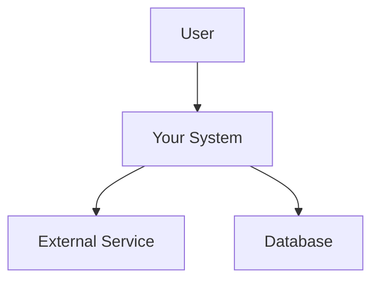

# [Design Title]

| Field        | Value                          |
| ------------ | ------------------------------ |
| Authors      | [Author names]                 |
| Status       | Draft                          |
| Created      | YYYY-MM-DD                     |
| Last Updated | YYYY-MM-DD                     |
| Reviewers    | [Reviewer names]               |

## Context and Scope

_Provide an objective overview of the landscape in which this design exists. What is the current state? What related systems or prior designs should the reader know about? Assume general domain knowledge — keep it concise and factual._

## Goals and Non-Goals

### Goals

- [Goal 1: What problem does this solve?]
- [Goal 2: ...]

### Non-Goals

_Non-goals are things that could reasonably be goals but are explicitly excluded from this design's scope. They are NOT negated goals._

- [Non-Goal 1: e.g., "Multi-region support" when designing a single-region service]
- [Non-Goal 2: ...]

## The Actual Design

### Overview

_Summarize the proposed design at a high level. What is the key insight or approach?_

### System-Context Diagram

_Show how the system fits into the broader technical environment. Use Mermaid or similar diagram format._

### APIs

_Sketch the key APIs the system exposes or consumes. Focus on shape and trade-offs, not formal definitions._

### Data Storage

_Describe the data storage approach: technology choices, data format, and the trade-offs involved._

### Code and Pseudo-Code

_Include only if there are novel algorithms or non-obvious logic. Link to prototypes if available._

### Degree of Constraint

_How constrained is this design? What hard requirements shaped it? What flexibility exists?_

## Alternatives Considered

_What other approaches were considered? Why were they rejected? Emphasize trade-offs._

### Alternative 1: [Name]

- **Description**: ...
- **Pros**: ...
- **Cons**: ...
- **Why rejected**: ...

## Cross-Cutting Concerns

### Security

_Authentication, authorization, data protection, threat model considerations._

### Privacy

_PII handling, data retention, compliance (GDPR, etc.)._

### Observability

_Logging, monitoring, alerting, tracing strategy._

### Reliability

_Failure modes, recovery mechanisms, SLOs/SLAs._

### Scalability

_Expected load, growth projections, potential bottlenecks._

## Open Questions

- [Question 1: What still needs to be decided or investigated?]
- [Question 2: ...]
