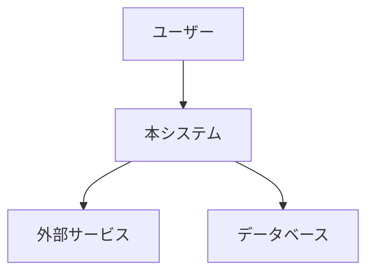

# [設計タイトル]

| 項目       | 内容                           |
| ---------- | ------------------------------ |
| 著者       | [著者名]                       |
| ステータス | Draft                          |
| 作成日     | YYYY-MM-DD                     |
| 最終更新日 | YYYY-MM-DD                     |
| レビュアー | [レビュアー名]                 |

## コンテキストとスコープ

_この設計が存在する背景を客観的に概説する。現在の状態はどうか？読者が知っておくべき関連システムや過去の設計はあるか？一般的なドメイン知識は前提とし、簡潔かつ事実に基づいて記述する。_

## ゴールとノンゴール

### ゴール

- [ゴール 1: この設計が解決する問題は何か？]
- [ゴール 2: ...]

### ノンゴール

_ノンゴールとは、ゴールになり得るが、この設計のスコープから明示的に除外するものである。ゴールの否定形ではない。_

- [ノンゴール 1: 例）単一リージョン向けサービスにおける「マルチリージョン対応」]
- [ノンゴール 2: ...]

## 設計の詳細

### 概要

_提案する設計をハイレベルに要約する。主要なアプローチや核となるアイデアは何か？_

### システムコンテキスト図

_システムがより広い技術環境の中でどのように位置づけられるかを示す。Mermaid などの図表形式を使用する。_

### API

_システムが公開・利用する主要な API をスケッチする。形式的な定義ではなく、概形とトレードオフに焦点を当てる。_

### データストレージ

_データストレージのアプローチを記述する：技術選定、データ形式、およびそのトレードオフ。_

### コードと疑似コード

_新規アルゴリズムや自明でないロジックがある場合のみ記載する。プロトタイプがあればリンクする。_

### 制約の度合い

_この設計はどの程度制約されているか？どのようなハード要件が設計を形作ったか？将来の変更に対する柔軟性はどの程度あるか？_

## 検討した代替案

_他にどのようなアプローチを検討したか？なぜ却下したか？トレードオフを強調する。_

### 代替案 1: [名前]

- **概要**: ...
- **メリット**: ...
- **デメリット**: ...
- **却下理由**: ...

## 横断的関心事

### セキュリティ

_認証、認可、データ保護、脅威モデルに関する考慮事項。_

### プライバシー

_個人情報の取り扱い、データ保持期間、コンプライアンス（GDPR 等）。_

### オブザーバビリティ

_ログ、モニタリング、アラート、トレーシングの戦略。_

### 信頼性

_障害モード、復旧メカニズム、SLO/SLA。_

### スケーラビリティ

_想定される負荷、成長予測、潜在的なボトルネック。_

## 未解決の課題

- [課題 1: まだ決定や調査が必要な事項は何か？]
- [課題 2: ...]
